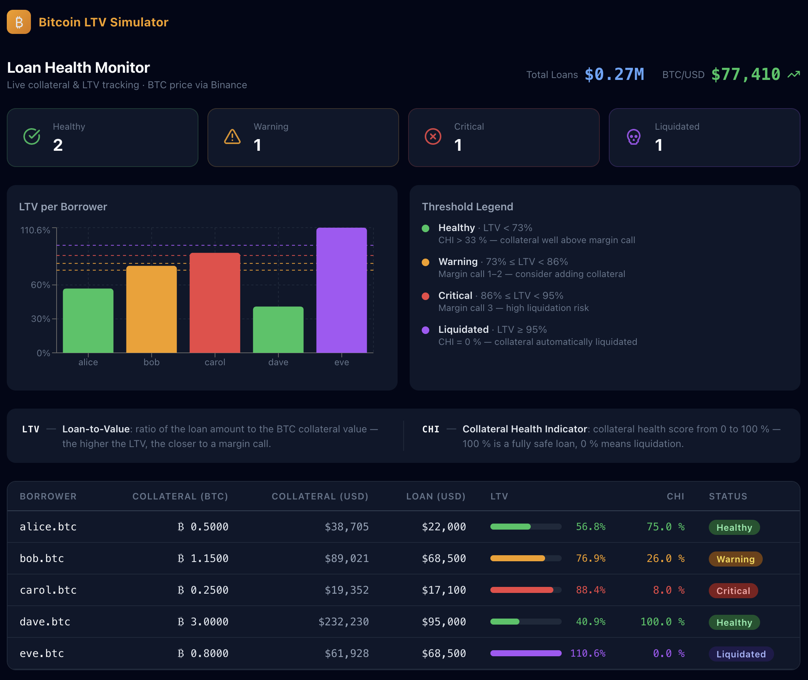
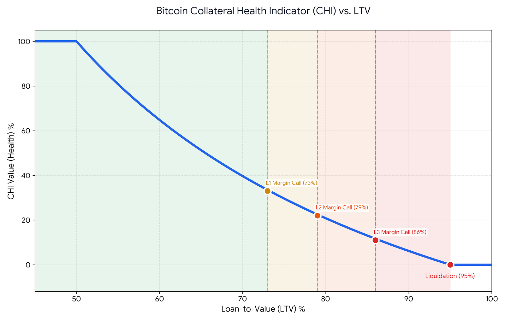

# Bitcoin Loan-to-Value (LTV) Simulator

A specialized technical tool designed to visualize loan health and liquidation risks for Bitcoin-backed lending. This project implements a **Collateral Health Indicator (CHI)** model inspired by the official Firefish documentation to demonstrate how debt dynamics work in volatile markets.

🌐 **Live demo:** [bitcoin-ltv-simulator.vercel.app](https://bitcoin-ltv-simulator.vercel.app/)

## 📱 Preview

*Interactive UI showing real-time CHI calculation and risk levels.*

## 🚀 Key Features
- **Live BTC Price:** Fetches the current Bitcoin price from the Binance public API every 5 minutes and recalculates LTV and CHI for all loans in real time.
- **Real-time CHI Calculation:** Implements a non-linear hyperbolic model to reflect risk acceleration as LTV increases.
- **Margin Call System:** Tracks the three critical threshold levels (MC1, MC2, MC3) defined in the [Official Firefish documentation](https://docs.firefish.io/faq/borrowing/collateral#what-is-a-margin-call).

- **Loan Detail & Liquidation:** Click any loan row to open a detail panel. Loans in Critical status reveal a *Request Liquidation* button that triggers a GraphQL mutation and immediately updates the loan status.
- **Mock GraphQL Backend:** Apollo Client is integrated with an in-process GraphQL executor — eliminating the need for a live backend while maintaining a full query/mutation architecture for a seamless transition to a live production API.
- **Tech Stack:** TypeScript · React 19 · Apollo Client · Recharts · Vite · Docker

## 🚦 Health Status & Margin Calls
The simulator categorizes loan safety into distinct zones. The transition points (73%, 79%, and 86%) are the exact moments where the system triggers a Margin Call.

| Status | LTV Range | CHI Range | Margin Call Level |
| :--- | :--- | :--- | :--- |
| 🟢 **Healthy** | LTV < 73% | 100% - 33% | None |
| 🟡 **Warning** | 73% ≤ LTV < 86% | 33% - 12% | MC1 (73%) · MC2 (79%) |
| 🔴 **Critical** | 86% ≤ LTV < 95% | 12% - 1% | MC3 (86%) |
| 🟣 **Liquidated** | LTV ≥ 95% | 0% | Collateral Liquidated |

## 🧮 Technical Implementation

### The CHI Formula
To represent financial risk accurately, I implemented a **hyperbolic decay model** instead of a simple linear scale. This ensures that the "Health" of the loan decreases more rapidly as the LTV approaches the liquidation threshold.

The formula is based on the **Collateral Ratio** ($1/LTV$):

$$CHI = 100 \cdot \frac{\frac{1}{LTV} - \frac{1}{LTV_{liq}}}{\frac{1}{LTV_{safe}} - \frac{1}{LTV_{liq}}}$$

Where $LTV_{safe} = 0.50$ and $LTV_{liq} = 0.95$.

> **Note on Boundary Conditions:**
> To maintain a consistent UI scale, the resulting value is **clamped to the range [0, 100]**:
> - If $LTV \le 50\%$, CHI is fixed at **100%** (Maximum Health).
> - If $LTV \ge 95\%$, CHI is fixed at **0%** (Liquidation).

### Visualization

*The curve demonstrates how risk accelerates. The dashed lines highlight the specific Margin Call triggers (73%, 79%, 86%) as defined in the official documentation.*

## 🧪 Tests

Unit tests cover the core business logic — CHI formula and LTV status thresholds:

```bash
npm test
```

## 🛠️ Setup and Installation

1. **Clone the repository:**
   ```bash
   git clone https://github.com/ondrejmaca/Bitcoin-LTV-Simulator.git
   ```

2. **Start with Docker:**
   ```bash
   docker compose up
   ```

3. **Open in browser:**
   ```bash
   # The app will be running at:
   http://localhost:5174
   ```